# FIR Filter Design via Window Method — MATLAB

This project designs a **7th-order highpass FIR filter** using three window functions — Rectangular, Hamming, and Hanning — and validates hand-calculated results against MATLAB's default built-in functions.

---

## Frequency Characteristic


$$H(\omega) = \begin{cases} 
e^{-j3\omega} & \frac{3\pi}{4} \leq |\omega| \leq \pi \\ 
0 & \text{otherwise} 
\end{cases}$$


- **Filter Type:** Highpass
- **Filter Order:** 7th order (6th degree, 7 coefficients)
- **Cutoff Frequency:** 3π/4 (normalized: 0.75)
- **Windows Used:** Rectangular, Hamming, Hanning

---

## Repo Structure

```
fir-filter-design-matlab/
├── matlab-code/
│   ├── hand-calculated/
│   │   └── fir-filter-handcalc.m     ← hand-calculated approach (all 3 windows)
│   └── default-functions/
│       ├── fir-rect.m                ← rectangular window (MATLAB default)
│       ├── fir-hamming.m             ← hamming window (MATLAB default)
│       └── fir-hanning.m             ← hanning window (MATLAB default)
├── results/                          ← magnitude, phase, and pole-zero plots for all 3 windows
└── README.md
```

---

## Window Functions

**Rectangular**

$$w(n) = 1$$

**Hamming**

$$w(n) = 0.54 + 0.46 \cdot \cos\left(\frac{2\pi n}{N-1}\right)$$

**Hanning**

$$w(n) = 0.5 - 0.5 \cdot \cos\left(\frac{2\pi n}{N-1}\right)$$

---

## Filter Coefficients

### Hand-Calculated Formula
The ideal impulse response derived from the inverse DTFT of H(ω):

$$h(n) = -\frac{1}{\pi(n-3)} \times \sin\left[\frac{3\pi}{4}(n-3)\right]$$

The windowed impulse response h'(n) is obtained by multiplying h(n) with the window function w(n):

$$h'(n) = h(n) \cdot w(n)$$

### Rectangular Window
| n | h(n) | w(n) | h'(n) |
|---|---|---|---|
| 0 | -0.0750 | 1 | -0.075 |
| 1 |  0.1591 | 1 |  0.159 |
| 2 | -0.2251 | 1 | -0.225 |
| 3 |  0.2500 | 1 |  0.250 |
| 4 | -0.2251 | 1 | -0.225 |
| 5 |  0.1591 | 1 |  0.159 |
| 6 | -0.0750 | 1 | -0.075 |

### Hamming Window
| n | h(n) | w(n) | h'(n) |
|---|---|---|---|
| 0 | -0.0750 | 1.00 | -0.0750 |
| 1 |  0.1591 | 0.77 |  0.1225 |
| 2 | -0.2251 | 0.31 | -0.0698 |
| 3 |  0.2500 | 0.08 |  0.0200 |
| 4 | -0.2251 | 0.31 | -0.0698 |
| 5 |  0.1591 | 0.77 |  0.1225 |
| 6 | -0.0750 | 1.00 | -0.0750 |

### Hanning Window
| n | h(n) | w(n) | h'(n) |
|---|---|---|---|
| 0 | -0.0750 | 0.00 |  0.0000 |
| 1 |  0.1591 | 0.25 |  0.0398 |
| 2 | -0.2251 | 0.75 | -0.1688 |
| 3 |  0.2500 | 1.00 |  0.2500 |
| 4 | -0.2251 | 0.75 | -0.1688 |
| 5 |  0.1591 | 0.25 |  0.0398 |
| 6 | -0.0750 | 0.00 |  0.0000 |

---

## Results

### Rectangular Window

**Hand Calculated**
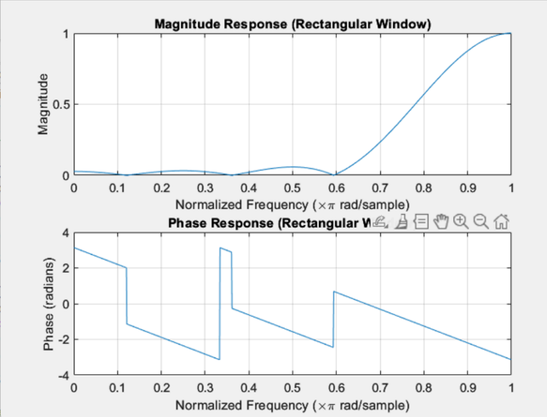

**Filter Coefficients (Hand Calculated)**
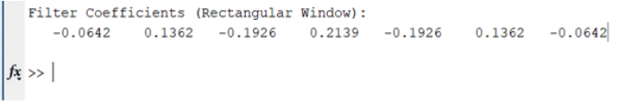

**MATLAB Default**
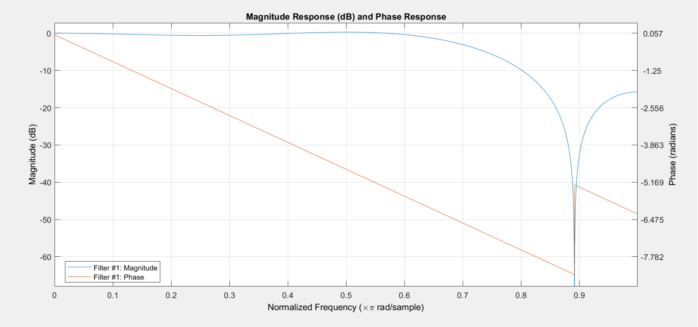

**Filter Coefficients (MATLAB Default)**
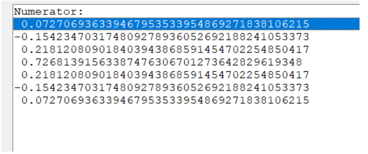

**Pole-Zero Plot (MATLAB Default)**
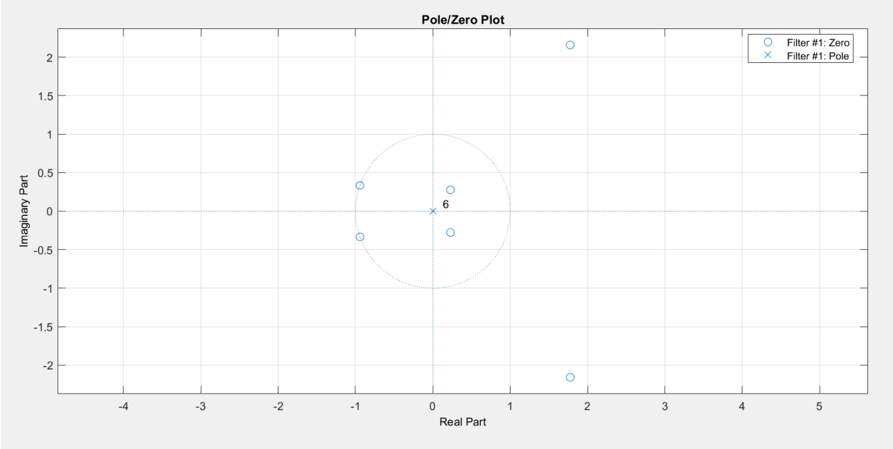

---

### Hamming Window

**Hand Calculated**
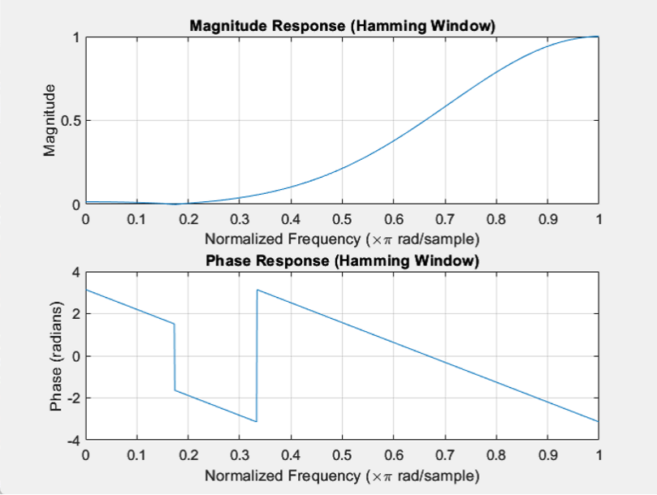

**Filter Coefficients (Hand Calculated)**
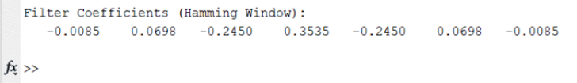

**MATLAB Default**
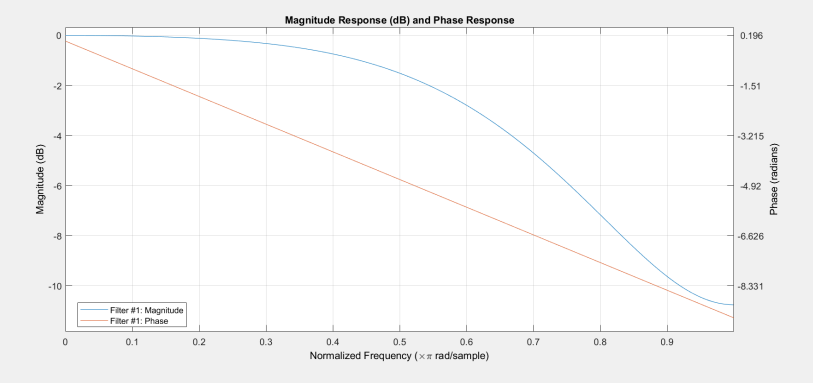

**Filter Coefficients (MATLAB Default)**
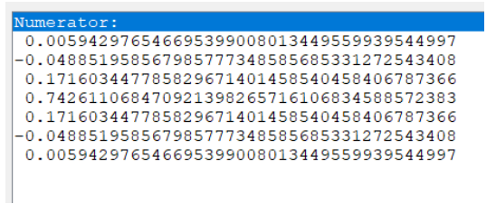

**Pole-Zero Plot (MATLAB Default)**
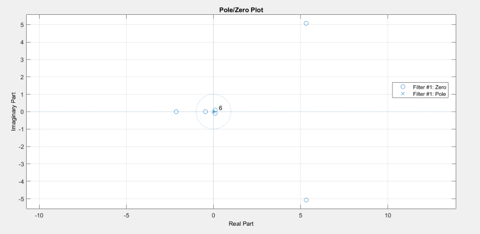

---

### Hanning Window

**Hand Calculated**
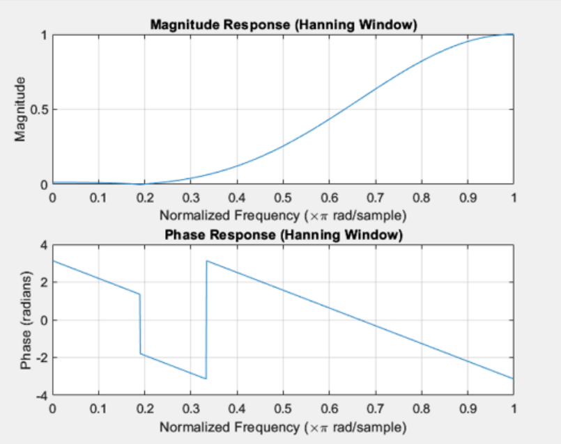

**Filter Coefficients (Hand Calculated)**
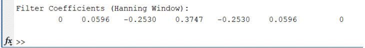

**MATLAB Default**
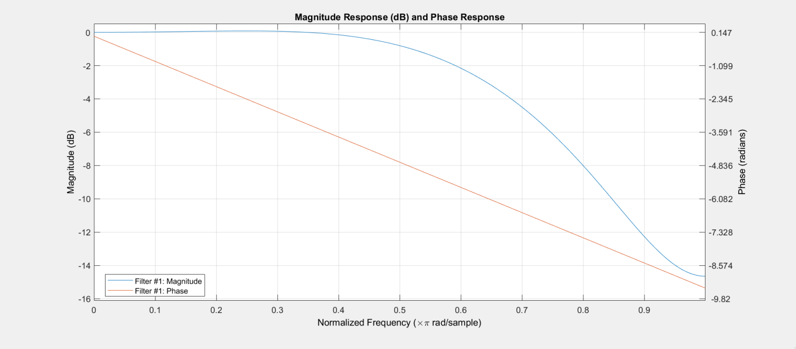

**Filter Coefficients (MATLAB Default)**
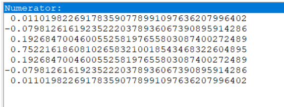

**Pole-Zero Plot (MATLAB Default)**
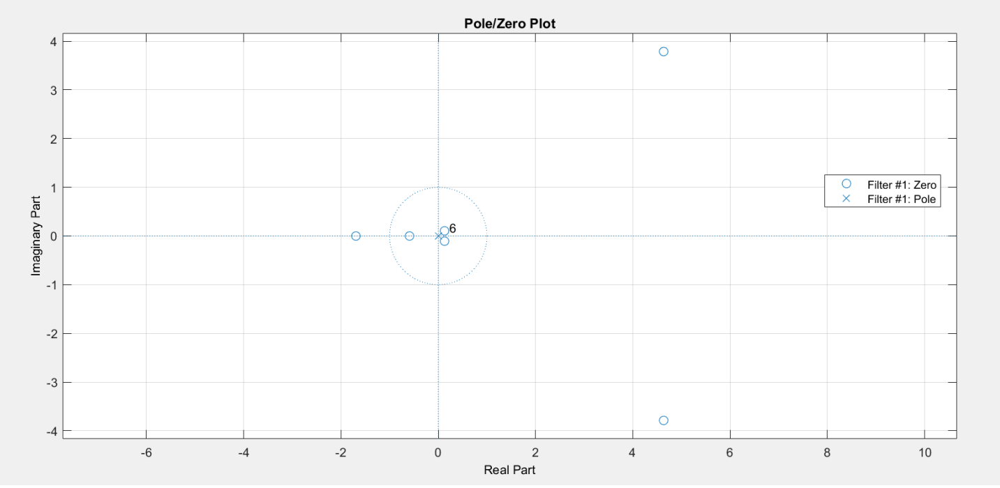

---

## Analysis & Conclusion

| Window | Phase Accuracy vs MATLAB | Sidelobe Level | Stability |
|---|---|---|---|
| Rectangular | Poor | Highest | Marginal |
| Hamming | Moderate | Medium | Marginal |
| **Hanning** | **Best** | **Lowest** | **Marginal** |

The **Hanning window** is the optimal choice for this design because:
- It has the **lowest sidelobe levels** among the three windows, minimizing spectral leakage
- Its hand-calculated filter coefficients and phase response **most closely match** MATLAB's built-in function results
- It provides the **smoothest frequency response** with the least energy leakage, resulting in better filter efficiency, requiring less power while providing more precise signal representation

All three windows produce marginally stable filters, with all poles located at the origin inside the unit circle.
